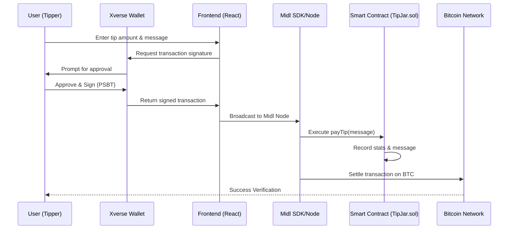

🧡 Xverse TipJar - Midl VibeHack

Native Bitcoin support for creators, powered by Midl.

Bitcoin TipJar is a premium decentralized application that enables creators to receive tips natively on the Bitcoin network using Midl’s programmable layer. It bridges the gap between Bitcoin’s security and EVM-like programmability, providing a seamless user experience for the Bitcoin Token Economy.

⸻

🚀 Vision

The goal of Bitcoin TipJar is to demonstrate that Bitcoin can be more than a store of value. By leveraging Midl, we’ve built a “vibrant” tipping platform where users can send BTC tips with custom messages, and creators can manage their funds through a secure, on-chain dashboard—all while signing transactions with their favorite Bitcoin wallet (Xverse).

✨ Key Features
	•	Native Bitcoin Payments: Tips are sent and settled as native BTC transactions via Midl’s abstraction layer.
	•	Xverse Wallet Integration: Seamlessly connect and sign transactions using the most popular Bitcoin wallet.
	•	Programmable Logic: Managed by a Solidity smart contract (TipJar.sol) for transparent tracking of total tips and tipper counts.
	•	Premium UI/UX: A responsive, dark-themed dashboard featuring glassmorphism, smooth animations, and real-time wallet stats.
	•	Owner Dashboard: Secure interface for creators to withdraw their aggregated tips back to their wallet.
	•	Real-time Verification: Direct links to the Midl Explorer for instant transaction proof.

🛠️ Tech Stack
	•	Protocol: Midl (Bitcoin Programmable Layer)
	•	Smart Contract: Solidity (EVM-compatible executiont on Bitcoin)
	•	Frontend: React + TypeScript + Vite
	•	SDK: @midl/react, @midl/core, @midl/connectors
	•	Wallet: Xverse
	•	Styling: Vanilla CSS (Premium Custom Design)
	•	Utilities: viem (for Bitcoin-to-EVM data handling), Lucide-React (icons)

🏗️ Architecture

The dApp uses Midl’s EVM compatibility to treat Bitcoin as a programmable asset.

sequenceDiagram
    participant U as User (Tipper)
    participant W as Xverse Wallet
    participant F as Frontend (React)
    participant M as Midl SDK/Node
    participant C as Smart Contract (TipJar.sol)
    participant B as Bitcoin Network

    U->>F: Enter tip amount & message
    F->>W: Request transaction signature
    W->>U: Prompt for approval
    U->>W: Approve & Sign (PSBT)
    W->>F: Return signed transaction
    F->>M: Broadcast to Midl Node
    M->>C: Execute payTip(message)
    C->>C: Record stats & message
    M->>B: Settle transaction on BTC
    B-->>U: Success Verification

	1.	User Interaction: User enters a tip amount and message in the React frontend.
	2.	SDK Logic: @midl/react hooks facilitate the connection to Xverse.
	3.	Signing: Xverse signs a Bitcoin transaction/PSBT, which Midl interprets as a call to the payTip function in our Solidity contract.
	4.	Settlement: The BTC is moved within the Midl layer and recorded on the Bitcoin network.

📺 Demo & Visuals

Product Demo

[!TIP]
This video demonstrates the end-to-end flow of connecting Xverse, sending a tip, and verifying it on the Midl Explorer.

🎥 Additional Demo

[!TIP]
This video provides an additional walkthrough of the Bitcoin TipJar in action, showcasing the full tipping and withdrawal flow.

📦 Getting Started

Prerequisites
	•	Node.js (v18+)
	•	Xverse Wallet extension installed.

Installation
	1.	Clone the repository:

git clone https://github.com/Qasim-Rokeeb/Xverse-TipJar
cd Antigravity


	2.	Install dependencies:

npm install


	3.	Start the development server:

npm run dev


	4.	Build for production:

npm run build


📜 Smart Contract

The TipJar.sol contract is designed for gas efficiency and security:
	•	payTip(string message): Updates the on-chain stats and accepts BTC.
	•	withdraw(): (Owner Only) Transfers the contract balance to the creator.
	•	totalTips: Public state variable tracking the total volume.

🏆 VibeHack Contest

Built with passion for the Midl VibeHack. This project highlights the potential of the Bitcoin Token Economy by making native BTC interaction as easy as modern Web3.

⸻


## ✨ Key Features
- **Native Bitcoin Payments**: Tips are sent and settled as native BTC transactions via Midl's abstraction layer.
- **Xverse Wallet Integration**: Seamlessly connect and sign transactions using the most popular Bitcoin wallet.
- **Programmable Logic**: Managed by a Solidity smart contract (`TipJar.sol`) for transparent tracking of total tips and tipper counts.
- **Premium UI/UX**: A responsive, dark-themed dashboard featuring glassmorphism, smooth animations, and real-time wallet stats.
- **Owner Dashboard**: Secure interface for creators to withdraw their aggregated tips back to their wallet.
- **Real-time Verification**: Direct links to the Midl Explorer for instant transaction proof.

## 🛠️ Tech Stack
- **Protocol**: [Midl](https://midl.xyz) (Bitcoin Programmable Layer)
- **Smart Contract**: Solidity (EVM-compatible executiont on Bitcoin)
- **Frontend**: React + TypeScript + Vite
- **SDK**: `@midl/react`, `@midl/core`, `@midl/connectors`
- **Wallet**: Xverse
- **Styling**: Vanilla CSS (Premium Custom Design)
- **Utilities**: `viem` (for Bitcoin-to-EVM data handling), `Lucide-React` (icons)

## 🏗️ Architecture
The dApp uses Midl's EVM compatibility to treat Bitcoin as a programmable asset.



1. **User Interaction**: User enters a tip amount and message in the React frontend.
2. **SDK Logic**: `@midl/react` hooks facilitate the connection to Xverse.
3. **Signing**: Xverse signs a Bitcoin transaction/PSBT, which Midl interprets as a call to the `payTip` function in our Solidity contract.
4. **Settlement**: The BTC is moved within the Midl layer and recorded on the Bitcoin network.

## 📺 Demo & Visuals

### Product Demo
[](https://www.youtube.com/watch?v=dQw4w9WgXcQ)

> [!TIP]
> This video demonstrates the end-to-end flow of connecting Xverse, sending a tip, and verifying it on the Midl Explorer.

## 📦 Getting Started

### Prerequisites
- Node.js (v18+)
- [Xverse Wallet](https://www.xverse.app/) extension installed.

### Installation
1. Clone the repository:
   ```bash
   git clone https://github.com/Qasim-Rokeeb/Xverse-TipJar
   cd Antigravity
   ```
2. Install dependencies:
   ```bash
   npm install
   ```
3. Start the development server:
   ```bash
   npm run dev
   ```
4. Build for production:
   ```bash
   npm run build
   ```

## 📜 Smart Contract
The `TipJar.sol` contract is designed for gas efficiency and security:
- `payTip(string message)`: Updates the on-chain stats and accepts BTC.
- `withdraw()`: (Owner Only) Transfers the contract balance to the creator.
- `totalTips`: Public state variable tracking the total volume.

## 🏆 VibeHack Contest
Built with passion for the **Midl VibeHack**. This project highlights the potential of the Bitcoin Token Economy by making native BTC interaction as easy as modern Web3.

---

### Developed By
[Qasim Rokeeb] — *Built for the Future of Bitcoin.*
